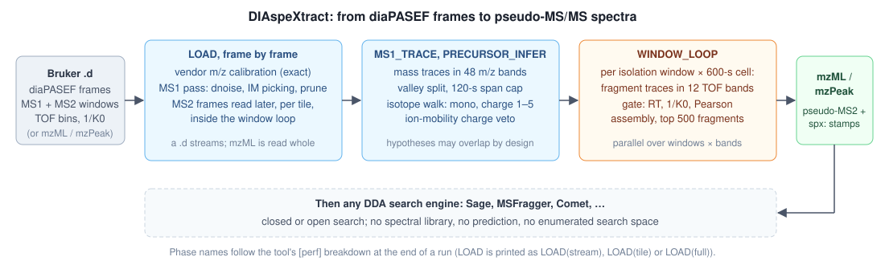
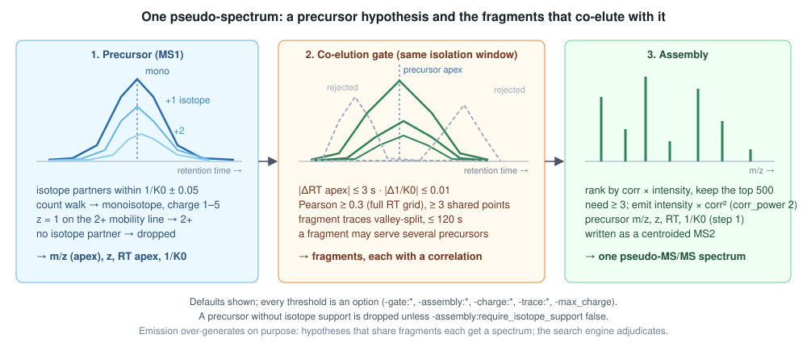
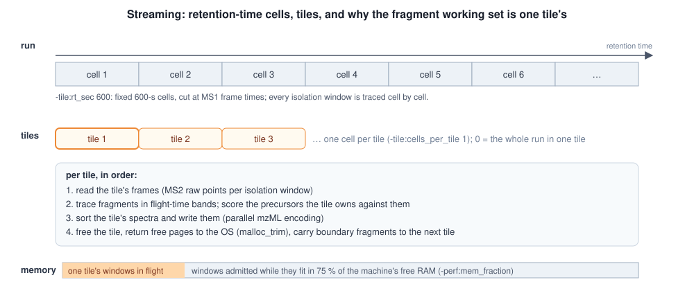

<p align="center"></p>

# DIAspeXtract

Extract pseudo-DDA ("pseudo-MS/MS") spectra from Bruker timsTOF **diaPASEF** data, so that any ordinary DDA search
engine can search them.

DIAspeXtract reads a diaPASEF acquisition (a Bruker `.d`, or mzML / mzPeak), finds precursor ions in the MS1 frames,
finds fragment ions in the isolation windows, pairs every precursor with the fragments that co-elute with it in both
retention time and ion mobility, and writes one MS2 spectrum per precursor hypothesis to mzML or mzPeak. Sage,
MSFragger, Comet or anything else that reads mzML can then search the output like a DDA file. There is no spectral
library, no prediction and no enumeration of the search space, which is the point: an **open or blind search** over the
output can report sequence variants and unexpected modifications that a library-based DIA workflow cannot represent.

It is a standalone application under BSD-3-Clause. **OpenMS is a prerequisite, not a host**: the tool links against a
patched OpenMS source tree but lives outside it. Earlier releases were named speXtract (up to 1.1.0) and DIAspeXtractor
(1.2.x); [CHANGELOG.md](CHANGELOG.md) maps the old names, options and defaults to the current ones.

## How it works

<p align="center"></p>

1. **Load.** A `.d` is read frame by frame in decode batches and never held whole: the first pass reads the MS1
   frames only, and the MS2 frames of each retention-time tile are read later, inside the window loop. Flight time
   becomes m/z through the acquisition's own `MzCalibration` table, evaluated exactly (the vendor model with digitizer
   temperature, the `C4` mass offset and a quadratic term `C2` of either sign; an unsupported table fails closed). MS1
   frames pass through the dnoise MS1 filter (streak, halo and isolation-window gates on the raw points), are
   peak-picked along ion mobility, and pruned of centroids at or below the noise threshold. An mzML input is read
   whole.
2. **Precursors.** MS1 mass traces are detected in 48 m/z bands in parallel, split at chromatographic valleys and
   trimmed to 120 s around their apex. Traces that sit one isotope apart at the same mobility are walked into
   envelopes: the walk assigns the monoisotopic peak and a charge from 1 to 5, an ion-mobility veto re-calls a z = 1
   envelope that lies on the run's own 2+ trend line, and hypotheses without an isotope partner are dropped.
3. **Fragments and the gate.** For every isolation window and 600-s cell, the tile's MS2 frames are read and fragment
   mass traces are detected in 12 flight-time bands on the integer TOF axis, then split and trimmed like the precursors.
   A fragment joins a precursor's spectrum when both lie in the same isolation window, its apex is within 3 s and
   0.01 1/K0 of the precursor's, and the two elution profiles correlate (Pearson ≥ 0.3 over the full retention-time
   grid, with at least 3 shared points).
4. **Assembly and output.** The accepted fragments are ranked by correlation-weighted intensity and the top 500 kept;
   a spectrum with at least 3 of them is written with a synthetic precursor (apex m/z, charge, retention time, 1/K0),
   each fragment's emitted intensity multiplied by its correlation raised to `-assembly:corr_power` (2 by default, so squared). Spectra are sorted per tile and
   serialised in parallel. The header records every setting that shaped the output.

<p align="center"></p>

**Two detectors.** `-trace:detector integer` (default) works on the instrument's flight-time bins and never
converts its compact store back to double m/z; it needs the vendor calibration and falls back, loudly, to `openms`
without it. `-trace:detector openms` runs OpenMS `MassTraceDetection` on a materialised peak map. They are different
algorithms that agree on about 85 % of the identified peptides; neither wins on every file and engine, and `integer`
uses about 40 % less memory, which is why it is the default. Design notes: [docs/MZ-AXIS-DESIGN.md](docs/MZ-AXIS-DESIGN.md),
[docs/INTEGER-TRACING-DESIGN.md](docs/INTEGER-TRACING-DESIGN.md), [docs/charge-inference.md](docs/charge-inference.md).

**Emission is deliberately generous.** Two precursor hypotheses that share fragments each get their own spectrum, and
a fragment may appear in several spectra. Search engines cope with that well; merging or deduplicating the output
downstream loses peptides, so search it as written.

### Streaming and memory

<p align="center"></p>

Memory, not CPU, decides whether a run fits a machine. The window loop therefore runs **tile by tile**: the run is cut
into fixed 600-s retention-time cells at MS1 frame times, each tile (one cell by default) is read, traced, scored,
sorted and written before the next one starts, and the fragments that straddle a cut are carried over. Tiling
bounds the fragment working set; the MS1 traces and precursors of the whole run stay resident throughout. Within a
tile, isolation windows are admitted while they fit in 75 % of the machine's free RAM, so the run adapts to
neighbours on a shared machine; one window is always admitted whatever the memory says, so a single oversized window cannot deadlock the run. Between tiles the allocator's free pages are returned to the OS.

## Requirements

| | |
|---|---|
| OpenMS | the development commit pinned in `patches/openms.lock`, patched by `scripts/apply_openms_patches.sh` and built `WITH_OPENTIMS` to read Bruker `.d`. No released OpenMS package works: the tool installs a header into the OpenMS tree, calls a method the patch adds, and refuses to compile against an unpatched `MassTrace` |
| Compiler | C++20. CI builds the tool with GCC on Ubuntu; the headers also compile with GCC 11, AppleClang and MSVC |
| OpenMP | required |
| CMake | 3.21+ for OpenMS (the tool itself needs 3.16) |
| Memory | 32+ GB |
| Disk | about 10 kB per spectrum as mzML, tens of GB for a 2-hour acquisition; mzPeak is about a third of that |


## Install

```bash
git clone https://github.com/okohlbacher/diaspextract.git
cd diaspextract

# 1. OpenMS at the pinned commit, patched, built. No released package works.
git clone https://github.com/OpenMS/OpenMS.git /path/to/OpenMS
git -C /path/to/OpenMS checkout $(sed -n 's/^OPENMS_BASE=//p' patches/openms.lock)
cmake -S /path/to/OpenMS -B /path/to/OpenMS/build -DCMAKE_BUILD_TYPE=Release \
      -DWITH_OPENTIMS=ON -DWITH_GUI=OFF -DHAS_XSERVER=OFF      # plus OpenMS's own dependencies
scripts/apply_openms_patches.sh /path/to/OpenMS                 # installs a header, applies four patches
cmake --build /path/to/OpenMS/build -j                          # the patches change headers and libOpenMS

# 2. The tool.
cmake -B build -DOpenMS_DIR=/path/to/OpenMS/build
cmake --build build -j
export OPENMS_DATA_PATH=/path/to/OpenMS/share/OpenMS   # a source-built OpenMS has no installed share/
```

The binary is `build/diaspextract`; `cmake --install build` puts it under `<prefix>/bin`. The GitHub workflow
`.github/workflows/build.yml` performs the same recipe on Ubuntu and is the reference.

### The four OpenMS patches

`scripts/apply_openms_patches.sh` applies them; all four matter, and the build stops without the first and third.

| patch | what it changes | why |
|---|---|---|
| `openms-brukertims-mz-calibration.patch` + `src/TdfMzCalibration.h` | the Bruker reader converts flight time with the acquisition's exact calibration model instead of a two-point chord | the chord is −5 to −11 ppm off, m/z dependent, worth 6–11 % of closed-search identifications; the mzML records which model ran (`spx:mz_calibration`) |
| `openms-epd-lockfree.patch` | removes a program-global critical section from elution-peak detection | called from a parallel window loop, that one lock burned about a quarter of the CPU in blocked threads |
| `openms-masstrace-move.patch` | gives `MassTrace` move operations | OpenMS's defaulted copy operations made every `std::move` a deep copy; a `static_assert` enforces the patch |
| `openms-mzml-parallel-write.patch` | encodes mzML spectra in chunks on all threads, appended in index order | the writer was CPU-bound on one thread; byte-identical spectrum list, 20 s → 6 s on a 30-minute run |

Environment variables the patched libOpenMS reads, none needed for a normal run: `DIASPEXTRACT_ALLOW_CHORD_FALLBACK=1`
opts into the legacy chord when the exact calibration is unavailable (otherwise the run fails closed; the MS1
denoiser needs the exact model, so this and the SDK path below require `-dnoise:ms1 false`);
`DIASPEXTRACT_LOAD_BATCH=<n>` sets the frames per decode batch (default 256; output-neutral);
`DIASPEXTRACT_SDK_PARALLEL` (any value) lets the loader decode frames in parallel even when Bruker's library does
the conversion, which otherwise runs serially because that library's thread safety is not guaranteed. Optionally,
`OPENMS_BRUKER_SDK_PATH=/path/to/libtimsdata.so` uses Bruker's own library for the conversion as an independent
cross-check; it is not redistributed. A leftover `SPEXTRACTOR_*` or `DIASPEXTRACTOR_*` variable from an earlier
release makes the tool refuse to start, naming the variable and its new spelling.

### Optional: mzPeak

Build the mzPeak C++ library against the same Arrow/Parquet/libzip that OpenMS uses (`scripts/build_mzpeak_lib.sh`)
and configure the tool with `-DMZPEAK_ROOT=<checkout>`. This also needs the OpenMS mzPeak integration, which the
pinned commit does not carry. The plain recipe above reads `.d` and mzML and writes mzML; `.d` stays the faster input.

## Run

```bash
diaspextract -in sample.d -out pseudo.mzML
```

That is the whole command. The defaults are the recommended configuration; `-threads` defaults to every core of the
machine, so pass `-threads <n>` on a shared machine. Then search the output like any DDA file:

```bash
sage sage.json -o results pseudo.mzML
```

Control FDR **per precursor charge** downstream: singly charged precursors are emitted by default (they are genuine
1+ ions on tryptic data) and their stratum carries a higher entrapment FDR than a pooled 1 % cut implies. If your FDR
procedure cannot stratify by charge, filter the search results per precursor charge yourself, or run with
`-charge:min_charge 2` to emit only 2+ and higher.

### Options

`diaspextract --helphelp` prints every option with its default. Defaults below are the shipped ones. The detection,
charge, gate, assembly and denoising options shape the spectra by definition; in the memory and concurrency table,
only the options marked **changes output** move the spectrum list, the others cost or save time and memory.

**Which option for what.** Memory: `-tile:cells_per_tile` (1 is the smallest footprint), `-perf:max_concurrent_windows`
and `-perf:mem_fraction`; avoid `.mzpeak` output and `-trace:detector openms` on a small machine, both process the
whole run at once. Time: `-threads`, and `-perf:malloc_trim false` when memory is not the constraint. Sensitivity:
`-perf:stream_load false` on a machine with the memory for it, `-assembly:im_weight_sigma 0.005` for a Sage search,
and trying `-trace:detector openms` on your own data. Charge and FDR: `-charge:min_charge`.

**Input and output**

| option | default | meaning |
|---|---|---|
| `-in` | required | a Bruker `.d` directory, an mzML, or an mzPeak archive |
| `-out` | required | output file; the format follows the extension (`.mzML` or `.mzpeak`). mzPeak is written in one piece, so the whole run is processed as one tile at whole-run memory; write `.mzML` when memory is tight or a search comes next |
| `-out_type` | follows the extension | force `mzML` or `mzpeak` |
| `-threads` | all cores | worker threads. Without `-threads` on the command line the tool uses every core; an ini value above 1 is honoured, an ini `threads = 1` counts as unset |
| `-ini`, `-write_ini` | | read or write a TOPP ini file with every option |
| `-log`, `-no_progress`, `-debug` | | log to a file, silence progress, raise the debug level |

**Memory and concurrency (`perf:`, `tile:`)** — output-neutral unless marked.

| option | default | meaning |
|---|---|---|
| `-tile:cells_per_tile` | 1 | cells per tile. The fragment working set is one tile's; 0 runs the whole run as one tile, at several times the memory |
| `-tile:rt_sec` | 600 | pitch of the retention-time cells, cut at MS1 frame times. **Changes output**: peptides eluting within 15 s of a cut line are lost a few points more often than elsewhere, about 0.2 % of the identified set at 600 s. −1 = one cell, the whole run in memory (`-tile:cells_per_tile` then has no effect) |
| `-perf:mem_fraction` | 0.75 | fraction of the machine's currently free RAM the window loop may commit; re-decided at every window admission |
| `-perf:max_concurrent_windows` | 0 = all | upper bound on isolation windows in flight; lower it to trade wall time for memory |
| `-perf:malloc_trim` | true | return free pages to the OS at the phase boundaries and between tiles: about 30 % off the peak of a one-tile run for about 8 % more wall; `false` when time is the constraint |
| `-perf:stream_load` | true | read the `.d` frame by frame. `false` holds the run in memory (1.75× memory, 1.7× wall) and **changes output** (+2 % Sage peptides on a large file at unchanged entrapment FDR) |
| `-perf:ms1_prune` | true | drop MS1 centroids at or below `trace:noise_threshold_int` while loading, in a way that leaves the output identical; `false` keeps every centroid and only costs memory |
| `-perf:ms1_trace_bands` | 48 | m/z bands for parallel MS1 trace detection; 1 = off. The band count moves the output slightly |
| `-perf:trace_bands` | 12 | flight-time bands per isolation window for parallel fragment tracing; 1 = off. The band count moves the output |

**Mass-trace detection (`trace:`)**

| option | default | meaning |
|---|---|---|
| `-trace:detector` | integer | `integer` (flight-time bins, needs the vendor calibration) or `openms` (`MassTraceDetection`); different algorithms, see above. `openms` traces whole windows: no cells, no tiles, whole-run memory |
| `-trace:mass_error_ppm` | 15 | m/z tolerance for trace extension |
| `-trace:noise_threshold_int` | 100 | MS1 noise intensity threshold |
| `-trace:ms2_noise_threshold_int` | 10 | MS2 noise intensity threshold |
| `-trace:min_length_sec` | 3 | minimum MS1 trace length |
| `-trace:ms2_min_length_sec` | 0 | minimum MS2 trace length; 0 = no length filter |
| `-trace:ms1_chrom_peak_snr`, `-trace:ms2_chrom_peak_snr` | 3, 1 | apex threshold as a multiple of the noise threshold, MS1 and MS2 |
| `-trace:ms1_split_valleys`, `-trace:ms2_split_valleys` | 7, 7 | split traces at chromatographic valleys, value = expected peak FWHM in seconds; 0 = off |
| `-trace:split_scan_time` | frame | scan time behind the valley splitter: the run's MS1 cycle time (`frame`) or each trace's own (`trace`, OpenMS's behaviour, about 6 % fewer Sage peptides). **Changes output**; leave at `frame` |
| `-trace:max_span_sec` | 120 | trim every trace to this many seconds around its apex; 0 = no cap. **Changes output** (within 0.1 % of the peptides from 0 to 240) |
| `-trace:mz_estimator` | apex | reported m/z of a precursor trace: the most intense peak's (`apex`), the intensity-weighted centroid (`mean`) or the `median`. Fragment traces of the integer detector always report the calibrated m/z of their apex bin; with `-trace:detector openms` the estimator applies to them too. **Changes output**; `apex` identifies the most peptides on both engines |
| `-trace:band_edges` | acquisition | where the integer detector's band edges come from; leave at `acquisition`. `slab` (edges from the window's own peaks) needs `-perf:stream_load false`; the spectra differ slightly, the identifications hardly |
| `-trace:native_ms1_neighbors` | 0 | sum this many neighbouring MS1 frames on each side before picking (1 = 3 frames); needs `-perf:stream_load true` and `-dnoise:ms1 false`. **Changes output**: about 2.7× the spectra for about 8 % more Sage peptides, measured on older defaults |

**Precursor charge (`charge:`)**

| option | default | meaning |
|---|---|---|
| `-charge:min_charge` | 1 | lowest precursor charge to emit; `2` emits only 2+ and higher. Add `-charge:im_charge_veto false` only to reproduce the older charge handling without the mobility re-call |
| `-max_charge` | 5 | highest charge considered by the isotope walk |
| `-charge:scoring` | count | monoisotope and charge from the isotope partner count (`count`, ties to the lower charge) or from averagine cosine × co-elution (`envelope`) |
| `-charge:im_charge_veto` | true | fit the run's 2+ and 3+ mobility trend lines from its confident envelopes; a z = 1 call on the 2+ line is re-called 2+, one on the 3+ line loses its charge |
| `-charge:im_veto_band` | 2.5 | half-width of that band in MAD-sigma of the fit residuals |
| `-charge:iso_im_tolerance` | 0.05 | 1/K0 tolerance for isotope partners |
| `-charge:mono_averagine_guard`, `-charge:mono_averagine_select` | 0, off | averagine-based corrections of the monoisotope; off by default, neither improves identifications |

**Co-elution gate (`gate:`)**

| option | default | meaning |
|---|---|---|
| `-gate:delta_rt` | 3 s | maximum apex retention-time difference between precursor and fragment |
| `-gate:delta_im` | 0.01 | maximum 1/K0 difference |
| `-gate:min_correlation` | 0.3 | minimum Pearson correlation of the two elution profiles; raise for cleaner, sparser spectra |
| `-gate:min_correlation_points` | 3 | minimum shared XIC points for a correlation to count |
| `-gate:coelution` | pearson | correlation over the full RT grid, or `logoverlap` (AlphaDIA-style; the scale differs, retune the threshold) |
| `-gate:variance_support` | off | Pearson over the union support of the two profiles instead of the full grid (scale differs) |

**Assembly (`assembly:`)**

| option | default | meaning |
|---|---|---|
| `-assembly:min_fragments` | 3 | emit a spectrum only if at least this many fragments pass the gate (checked before the cap below) |
| `-assembly:max_fragments` | 500 | keep at most this many, top-ranked; keep it at or above `min_fragments` |
| `-assembly:corr_power` | 2 | multiply each emitted fragment's intensity by its correlation to this power; 0 = off. 2 gives +8–10 % Sage and +4–8 % MSFragger peptides over 0 |
| `-assembly:im_weight_sigma` | 0 = off | additionally weight fragments by their 1/K0 distance to the precursor (Gaussian, this sigma); this also changes which fragments survive the cut. 0.005 gave up to 7 % more Sage peptides and no change on MSFragger |
| `-assembly:require_isotope_support` | true | drop precursor hypotheses without an isotope partner; `false` doubles the spectra, runs about 7× slower and identifies fewer peptides |
| `-assembly:default_charge` | 2 | charge given to a precursor left without a charge call (only matters when guessed precursors are kept) |

**MS1 denoising (`dnoise:`)** — a bit-identical port of dnoise v0.1.0's MS1 path (Garrett, Diedrich & Yates III,
bioRxiv 2026.08.27.747603; MIT, `LICENSES/dnoise-MIT.txt`), applied to the raw points of every MS1 frame of a Bruker
`.d` before peak picking. Other inputs pass through, logged and stamped.

| option | default | meaning |
|---|---|---|
| `-dnoise:ms1` | true | on or off. **Changes output** (a few percent of the peptides, in either direction depending on the file) and lowers peak memory |
| `-dnoise:mz_half_width`, `-dnoise:min_feature_length`, `-dnoise:max_internal_gap`, `-dnoise:iterations`, `-dnoise:min_window_intensity`, `-dnoise:min_feature_intensity` | 3, 5, 2, 2, 0, 0 | the streak filter: a point survives when its TOF bin (± half width) is occupied in a run of scans of this length, bridging this many gaps, repeated this many times; the two intensity floors (0 = off) require a scan's window sum, and a run's total, to reach the value before it counts |
| `-dnoise:halo`, `-dnoise:halo_peak_fraction`, `-dnoise:halo_mz_idx_half_width`, `-dnoise:halo_scan_half_width` | true, 0.15, 80, 2 | the halo filter: keep a point at ≥ this fraction of the most intense streak survivor in its box, its own TOF bin excluded |
| `-dnoise:dia_ms1_window`, `-dnoise:dia_ms1_mz_pad`, `-dnoise:dia_ms1_im_pad` | true, 5, 0.05 | keep only MS1 points inside a padded diaPASEF isolation window |

**Diagnostics (`diag:`)**: `-diag:dump_ms1_tsv <prefix>` writes the MS1 traces and inferred precursors as TSV so a
lost precursor can be attributed to a stage.

### Reading the output

Every emitted spectrum is MS2 with a synthetic precursor: `selected ion m/z` (the apex m/z of the monoisotopic
trace), `charge state`, the precursor's retention time and 1/K0, and the isolation window it was taken from. The run
header carries sixteen `spx:` userParams that make any file attributable to the configuration that produced it: the
detector and calibration (`spx:detector`, `spx:mz_calibration`, `spx:require_isotope_support`, `spx:corr_power`,
`spx:pearson_G` (the correlation support, always `frames`), `spx:im_weight_sigma`), MS1 denoising (`spx:dnoise_ms1`, `spx:dnoise_ms1_params`,
`spx:dnoise_ms1_points`), the cell grid and tiling (`spx:tile_rt_sec`, `spx:tile_cells_per_tile`, `spx:tiles`,
`spx:tile_boundaries`, `spx:tile_source`), the band edges (`spx:band_edges`) and the frozen frame table
(`spx:frame_table`). `spx:mz_calibration` starts with `tdf_table_modeltype1` (mzPeak input appends how the table was recovered), or is
`bruker_sdk`, `legacy_chord_APPROXIMATE`, `mzpeak_two_point_transform` (an mzPeak archive read through its approximate
transform, on request) or `unset` (an mzML input, which carries its m/z as is).

## Layout

```
src/        the tool (one translation unit) plus four headers: the calibration model, the tdf reader,
            the MS1 denoiser and the mzPeak streaming loader
patches/    the four OpenMS patches, the pinned OpenMS commit (openms.lock) and the mzPeak build helpers
scripts/    the OpenMS patch application, the mzPeak library build, the option-token check, analysis scripts
test/       the end-to-end suite
tests/      the C++ unit tests, the calibration golden values, the calibration and entrapment Python checks
bench/      benchmark drivers, search configurations and the semantic digest
docs/       design notes and measurement records
assets/     the logo and the diagrams above
```

## Documentation

- [CHANGELOG.md](CHANGELOG.md): what changed in each release, with the earlier tool names and option names
- [CONTRIBUTING.md](CONTRIBUTING.md): building against OpenMS, running the tests, and the rule for changing a default
- [SECURITY.md](SECURITY.md)
- `docs/`: design notes and measurement records for developers, starting with [docs/BASELINE.md](docs/BASELINE.md)

## Citing

See [CITATION.cff](CITATION.cff).

## License

BSD-3-Clause. Derived from OpenMS (BSD-3-Clause); the MS1 denoiser is a port of dnoise (MIT). See [NOTICE](NOTICE).
