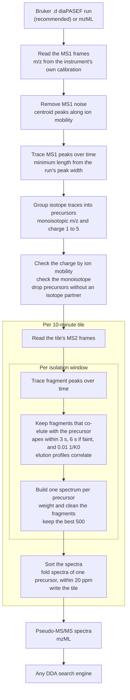

<p align="center"></p>

# DIAspeXtract

DIAspeXtract turns Bruker timsTOF **diaPASEF** data into pseudo-MS/MS spectra that any DDA search engine can
search. It finds the precursor ions in the MS1 frames, collects the fragments that elute with each precursor at the
same ion mobility, and writes one MS2 spectrum per precursor to mzML. It uses no spectral library, so an
**open or blind search** of the output can find sequence variants and unexpected modifications. It is a standalone
application under BSD-3-Clause that links a patched OpenMS.

Earlier releases were named speXtract (up to 1.1.0) and DIAspeXtractor (1.2.x); [CHANGELOG.md](CHANGELOG.md) maps
the old names to the current ones.

## How it works


```mermaid
flowchart TD
    IN["Bruker .d diaPASEF run<br/>(recommended) or mzML"] --> MS1["Read the MS1 frames<br/>m/z from the instrument's own calibration"]
    MS1 --> CLEAN["Remove MS1 noise<br/>centroid peaks along ion mobility"]
    CLEAN --> TRACE["Trace MS1 peaks over time<br/>minimum length from the run's peak width"]
    TRACE --> PREC["Group isotope traces into precursors<br/>monoisotopic m/z and charge 1 to 5"]
    PREC --> CHECK["Check the charge by ion mobility<br/>check the monoisotope<br/>drop precursors without an isotope partner"]
    subgraph TILE["Per 10-minute tile"]
        READ["Read the tile's MS2 frames"]
        subgraph WIN["Per isolation window"]
            FRAG["Trace fragment peaks over time"] --> GATE["Keep fragments that co-elute with the precursor<br/>apex within 3 s, 6 s if faint, and 0.01 1/K0<br/>elution profiles correlate"]
            GATE --> SPEC["Build one spectrum per precursor<br/>weight and clean the fragments<br/>keep the best 500"]
        end
        FOLD["Sort the spectra<br/>fold spectra of one precursor, within 20 ppm<br/>write the tile"]
    end
    CHECK --> READ
    READ --> FRAG
    SPEC --> FOLD
    FOLD --> OUT["Pseudo-MS/MS spectra<br/>mzML"]
    OUT --> SEARCH["Any DDA search engine"]
```

- **Read.** A `.d` is read frame by frame, and flight time becomes m/z through the acquisition's own calibration.
  MS1 frames are denoised with a port of dnoise (Garrett, Diedrich & Yates III, bioRxiv 2026.08.27.747603) and
  centroided along ion mobility. An mzML input is read whole, without noise removal (see [Run](#run)).
- **Precursors.** Traces one isotope apart at the same ion mobility form a precursor with a monoisotopic m/z and a
  charge from 1 to 5. Ion mobility corrects charge calls, the monoisotope is checked against the isotope pattern,
  and precursors without an isotope partner are dropped. Some tolerances are measured from each run.
- **Fragments.** In each isolation window, the MS2 peaks are traced over time on the instrument's flight-time bins.
- **Co-elution gate.** A fragment joins a precursor's spectrum when their apexes lie within 3 s and 0.01 1/K0 and
  their elution profiles correlate (r ≥ 0.3 over at least 3 shared points). A faint precursor, seen in at most 4
  frames, gets a looser test.
- **Spectrum.** Fragments are weighted by their ion-mobility distance and their correlation. Leftover isotopes of
  other precursors in the window are removed, split peaks of one fragment ion are fused, and the best 500 fragments
  are kept; a spectrum needs at least 3. A precursor found twice gets one spectrum with the fragments of both, so it
  can hold more than 500.
- **Tiles and memory.** Tiles run in time order, and the next tile is read while the current one runs. On Linux, a
  window starts only when it fits in 75 % of the free memory; elsewhere windows run one at a time. The output does
  not depend on the thread count.

## Requirements

| | |
|---|---|
| OpenMS | the development commit pinned in `patches/openms.lock`, patched by `scripts/apply_openms_patches.sh` and built `WITH_OPENTIMS` to read Bruker `.d`. A released OpenMS package does not work |
| Compiler | C++20 and OpenMP. CI builds the tool with GCC on Ubuntu |
| CMake | 3.21+ for OpenMS (the tool itself needs 3.16) |
| Platform | Linux is recommended. Elsewhere the tool cannot read the free memory and runs one isolation window at a time |
| Memory | about 5–20 GB for the HeLa runs of PXD017703 and 25–32 GB for the 130-minute tissue runs of PXD047793 (1.6.0 at the defaults with 100 threads, 43 public runs; see [CHANGELOG.md](CHANGELOG.md)) |
| Disk | the mzML output is large |

These memory figures are for a `.d` at the defaults. `DIASPEXTRACT_PIPE_TILES=1` and a lower
`-perf:max_concurrent_windows` need less. An mzML input, `-trace:detector openms` and `-tile:cells_per_tile 0`
process the whole run at once and need several times as much.

## Install

There are no prebuilt binaries; build from source as below. OpenMS needs its build dependencies, including Arrow
and Parquet; `.github/workflows/build.yml` lists the Ubuntu packages.

```bash
git clone https://github.com/okohlbacher/diaspextract.git
cd diaspextract

# 1. OpenMS at the pinned commit, patched, then built. No released package works.
git clone https://github.com/OpenMS/OpenMS.git /path/to/OpenMS
git -C /path/to/OpenMS checkout $(sed -n 's/^OPENMS_BASE=//p' patches/openms.lock)
scripts/apply_openms_patches.sh /path/to/OpenMS                 # installs a header, applies five patches
cmake -S /path/to/OpenMS -B /path/to/OpenMS/build -DCMAKE_BUILD_TYPE=Release \
      -DWITH_OPENTIMS=ON -DWITH_GUI=OFF -DHAS_XSERVER=OFF
cmake --build /path/to/OpenMS/build --target OpenMS -j          # the library only, not every OpenMS tool

# 2. The tool.
cmake -B build -DOpenMS_DIR=/path/to/OpenMS/build
cmake --build build -j
export OPENMS_DATA_PATH=/path/to/OpenMS/share/OpenMS   # a source-built OpenMS has no installed share/
```

The binary is `build/diaspextract`; `cmake --install build` puts it under `<prefix>/bin`. The GitHub workflow
`.github/workflows/build.yml` runs the same recipe on Ubuntu and is the reference.

`scripts/apply_openms_patches.sh` applies the five small OpenMS patches in `patches/`. They give the Bruker reader the
acquisition's exact m/z calibration, let the tool set the scan time that peak splitting uses, make tracing and mzML
writing faster on many threads, and let `--help` and the CTD and CWL export work for a tool outside OpenMS, so it can
be wrapped for KNIME or Galaxy. Apply all five: leaving one out stops the build, changes the spectra or slows the run.

A normal run needs no environment variables; the ones a user may set are listed in [docs/options.md](docs/options.md).
A leftover `SPEXTRACTOR_*` or `DIASPEXTRACTOR_*` variable from an earlier release makes the tool refuse to start and
names the new spelling.

**mzPeak.** mzPeak input and output need an OpenMS with mzPeak support, which the pinned commit lacks. Read the
`.d` and write mzML.

## Run

```bash
diaspextract -in sample.d -out pseudo.mzML
```

Give the tool the `.d` itself. An mzML input runs without MS1 noise removal and, because it carries no instrument
calibration, with the `openms` detector on the whole run: it needs more memory and gives different spectra.

Then search the output like any DDA file, for example with Sage (`bench/sage_closed.json` is a closed-search
configuration; set its FASTA first):

```bash
sage bench/sage_closed.json -o results pseudo.mzML
```

Control the FDR **per precursor charge**. Singly charged precursors are written by default: they are real 1+ ions,
but they carry a higher FDR than a pooled 1 % cut suggests. If your FDR step cannot separate charges, filter the
results per charge yourself, or run with `-charge:min_charge 2` to write only 2+ and higher.

## Options

The defaults are the recommended configuration. These are the settings users change most:

| setting | default | what it does |
|---|---|---|
| `-threads <n>` | all cores | worker threads; set it on a shared machine |
| `-charge:min_charge` | 1 | lowest precursor charge written; 2 leaves out singly charged precursors |
| `-tile:cells_per_tile` | 1 | 10-minute cells per tile; 0 processes the whole run as one tile, at several times the memory. The spectra do not change |
| `-perf:max_concurrent_windows` | 0 (no cap) | most isolation windows processed at once; fewer use less memory and take longer |
| `-perf:mem_fraction` | 0.75 | share of the free memory the windows may use (Linux) |
| `DIASPEXTRACT_PIPE_TILES=1` | 2 | environment variable: one tile at a time instead of two. Less memory, longer run, same spectra |
| `-perf:stream_load` | true | `false` loads the whole run first: much more memory, a longer run and different spectra |
| `-trace:detector` | integer | `openms` uses OpenMS mass-trace detection on whole windows, without tiles. The two find partly different peptides; `integer` needs a `.d` and uses much less memory |
| `-dnoise:ms1` | true | MS1 noise removal for `.d` input; `false` turns it off and changes the spectra |

Every option, with its default and valid values, is in [docs/options.md](docs/options.md) and in
`diaspextract --helphelp`.

## Output

Each spectrum is an MS2 spectrum with a synthetic precursor: the monoisotopic m/z, the charge, the retention time,
the 1/K0 and the isolation window it came from. A precursor gets its own spectrum even when it shares fragments with
another, and one fragment can appear in several spectra; this is intended, so search the output as written. The mzML
header records the settings that shaped the file as `spx:` entries.

## Reporting a problem

Open an issue at <https://github.com/okohlbacher/diaspextract/issues>. Include the `Version` line of
`diaspextract --help` (it names the OpenMS version too), the full command line, the end of the console output, and
the `spx:` lines from the output's header:

```bash
grep -a 'spx:' pseudo.mzML
```

[CONTRIBUTING.md](CONTRIBUTING.md#reporting-a-bug) has the details; report security issues as
[SECURITY.md](SECURITY.md) describes.

## Layout

```
src/        the tool and its headers: m/z calibration, .d metadata reader, MS1 denoiser, mzPeak loader
patches/    the five OpenMS patches, the pinned OpenMS commit (openms.lock) and mzPeak build helpers
scripts/    OpenMS patch application, mzPeak library build, option-name check
test/       the end-to-end tests
tests/      the unit tests and calibration checks
bench/      tools to compare outputs and check FDR, and a Sage configuration
docs/       the option reference
assets/     the logo
LICENSES/   third-party licenses
```

## Documentation

- [docs/options.md](docs/options.md): every option, and the environment variables a user may set
- [CHANGELOG.md](CHANGELOG.md): what changed in each release, with the earlier tool and option names
- [CONTRIBUTING.md](CONTRIBUTING.md): building, testing, reporting a bug, and the rule for changing a default
- [bench/README.md](bench/README.md): the benchmark tools
- [SECURITY.md](SECURITY.md)

## Citing

See [CITATION.cff](CITATION.cff).

## License

BSD-3-Clause. Derived from OpenMS (BSD-3-Clause); the MS1 denoiser is a port of dnoise (MIT). See [NOTICE](NOTICE).
